# Visual Diagrams for Presentation
## Warehouse AI Assistant - Copy-Paste Ready Mermaid Diagrams

These diagrams can be:
1. Rendered in GitHub/GitLab markdown
2. Converted to images using https://mermaid.live
3. Embedded in presentation slides
4. Printed as handouts

---

## Diagram 1: System Architecture Overview

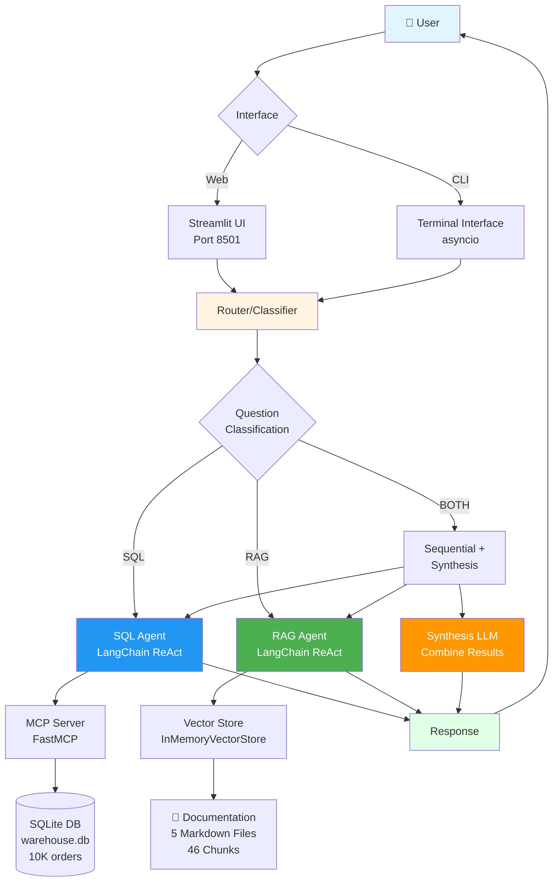

---

## Diagram 2: Multi-Agent Routing Flow

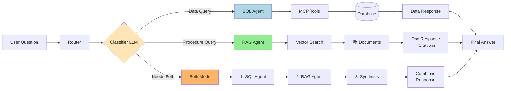

---

## Diagram 3: MCP Tool Architecture

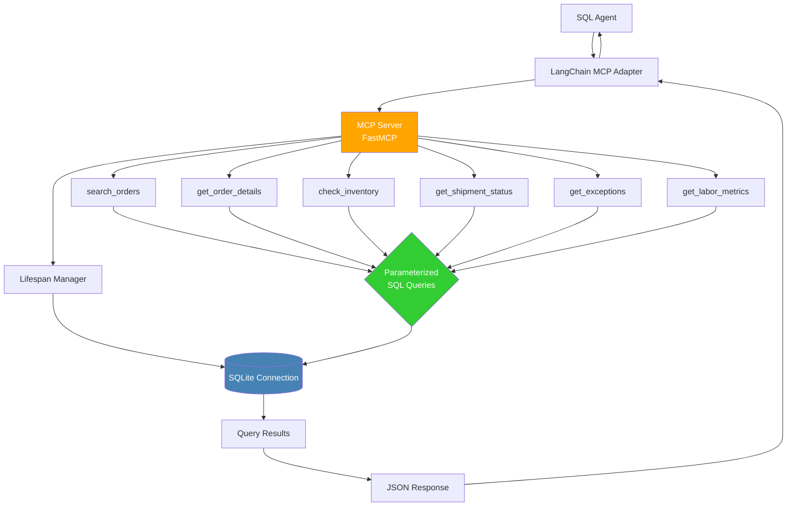

---

## Diagram 4: RAG Pipeline

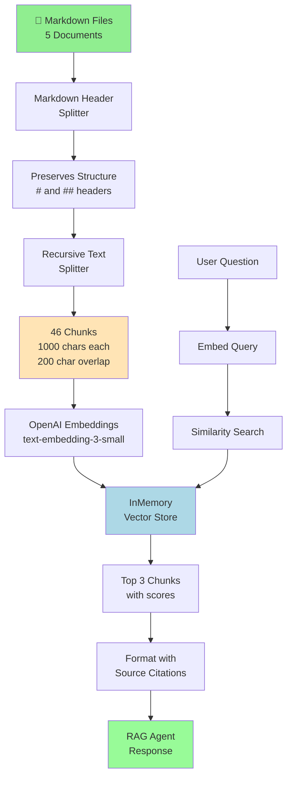

---

## Diagram 5: Database Schema

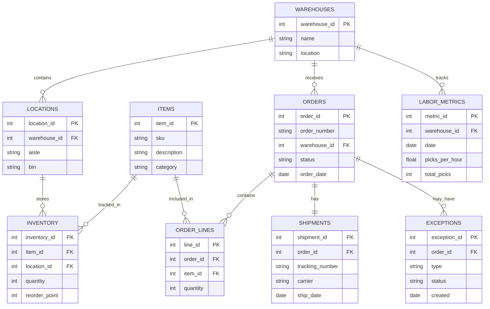

---

## Diagram 6: Conversation Flow

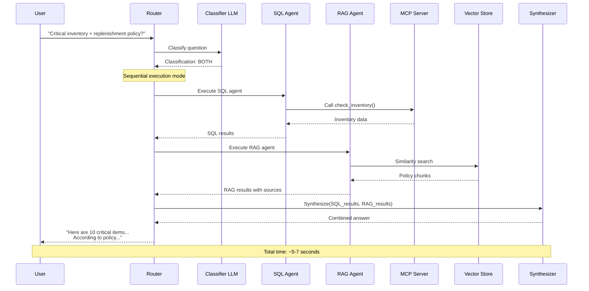

---

## Diagram 7: Project Structure Tree

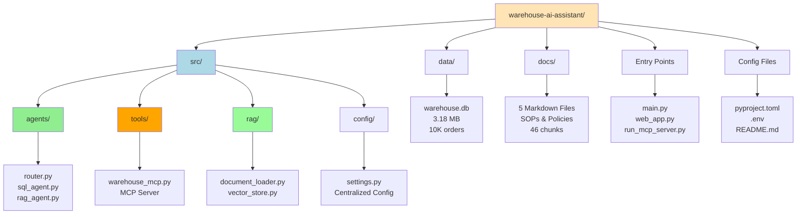

---

## Diagram 8: Course Integration Map

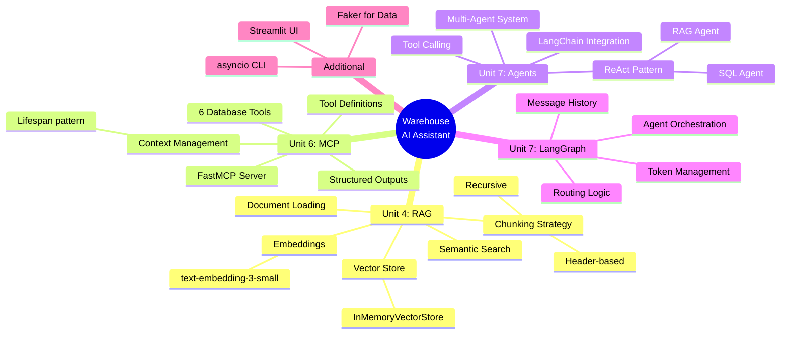

---

## Diagram 9: Data Flow - SQL Query

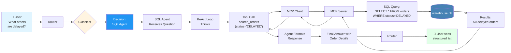

---

## Diagram 10: Data Flow - RAG Query

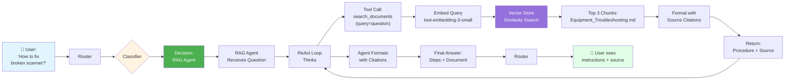

---

## Diagram 11: Data Flow - Both Agents

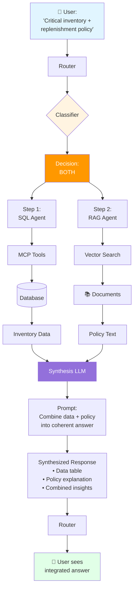

---

## Diagram 12: Technology Stack Layers

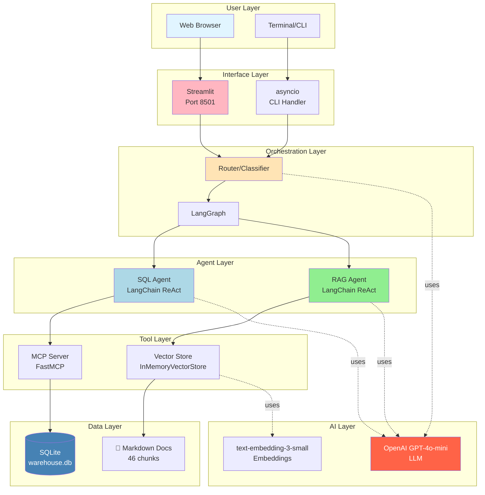

---

## Diagram 13: ROI Calculation Flow

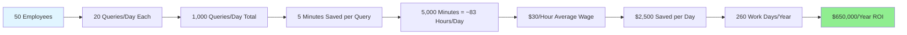

---

## Diagram 14: Production Deployment Path

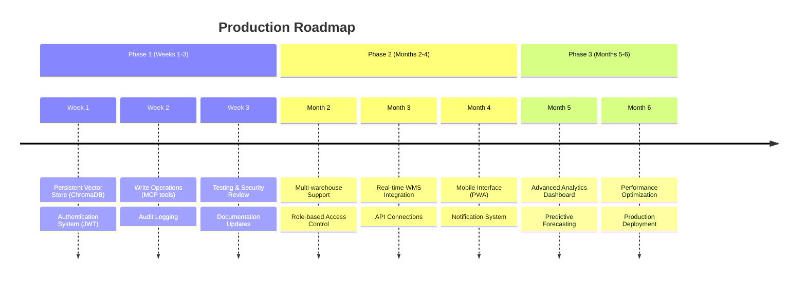

---

## How to Use These Diagrams

### Option 1: Render in Markdown
- GitHub/GitLab automatically render Mermaid
- Just include in your README.md or presentation markdown

### Option 2: Convert to Images
1. Go to https://mermaid.live
2. Copy-paste diagram code
3. Export as PNG/SVG
4. Insert into PowerPoint/Keynote

### Option 3: Use in Reveal.js
```html
<section data-markdown>
    <textarea data-template>
        ```mermaid
        [paste diagram here]
        ```
    </textarea>
</section>
```

### Option 4: Documentation
- Include in technical documentation
- Add to project wiki
- Share with stakeholders

---

## Diagram Customization Tips

### Change Colors
```mermaid
style NodeName fill:#HEX_COLOR,color:#TEXT_COLOR
```

### Add Icons (if supported)
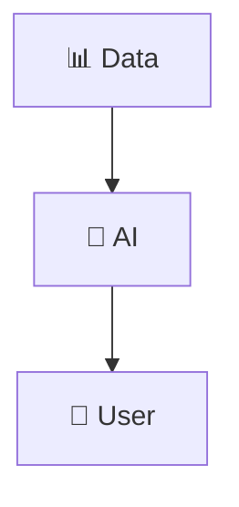

### Adjust Layout
- `TB` = Top to Bottom
- `LR` = Left to Right
- `RL` = Right to Left
- `BT` = Bottom to Top

---

**These diagrams make your presentation visual and professional!**

Choose 2-3 key diagrams for your slides, keep the rest as backup.

Recommended core diagrams:
1. **System Architecture Overview** (Diagram 1) - Shows everything
2. **Multi-Agent Routing** (Diagram 2) - Core innovation
3. **Project Structure** (Diagram 7) - Code organization

---

*Created: March 31, 2026*  
*Mermaid Version: Compatible with GitHub/GitLab*
